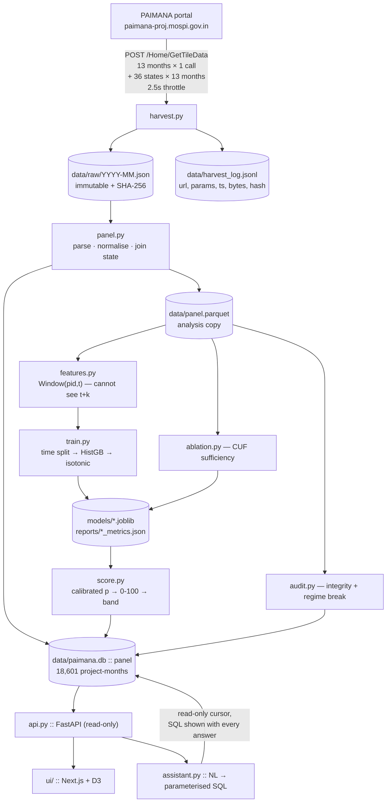
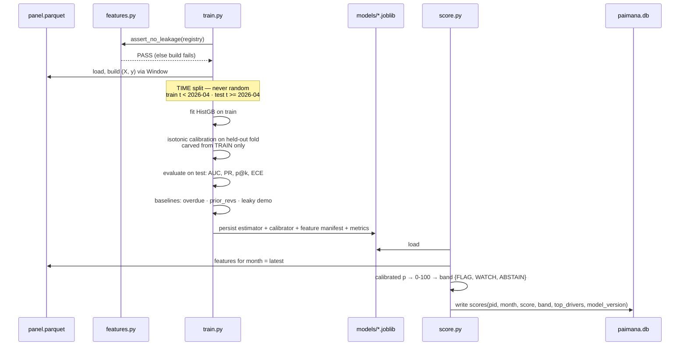
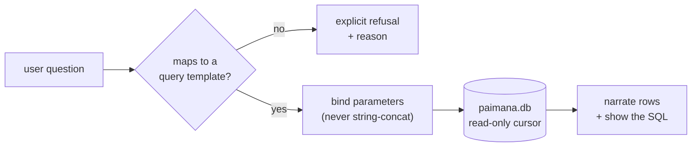

# Architecture — how this is actually built

**PS 26103 · MoSPI PAIMANA · team's pick 2**

Companion to `02_BUILD_PLAN.md` (which says *what to do in what order*). This file says
*how the pieces fit and why they are shaped that way*. Read this before writing code.

---

## 1. Four principles that drive every decision below

### 1.1 Raw snapshots are immutable; everything else is derived
`data/raw/YYYY-MM.json` is written once and never edited. The panel, features, models
and reports are all **recomputable from raw**. Any bug is fixed by changing a transform
and re-running — never by patching data in place.

*Why:* we are making claims about a government statistical series. If a judge asks "where
did this number come from", the answer must terminate at a file with a known SHA-256, not
at a cleaning step someone did by hand in a notebook.

### 1.2 Leakage is prevented structurally, not detected by review
The single largest technical risk (`00_FINDINGS.md` §2.1) is training on information from
the future. We do not rely on discipline. **The feature layer physically cannot see
rows after time *t*** (§4.2). The linter is a *second* layer that catches declaration
mistakes, not the primary defence.

*Why:* a leaky model here doesn't crash, it produces a *better* score. Errors that look
like success must be made impossible, not merely discouraged.

### 1.3 Deterministic core, LLM strictly at the edges
Every number that appears anywhere — score, rank, metric, anomaly count — is produced by
deterministic Python. The LLM selects queries and narrates results. **It never computes,
estimates, or adjusts a figure.**

*Why:* MoSPI's product is trustworthy statistics. An LLM in the numeric path is
disqualifying, and it is also unnecessary — nothing here needs it.

### 1.4 Abstention is a first-class output
Every scoring path can return `ABSTAIN`. It is not an error state; it is a supported
answer that routes to a human.

*Why:* the cost model has 163 positive events (`00_FINDINGS.md` §5). A system that hides
that behind a confident number is worse than one that says so.

---

## 2. End-to-end data flow



**Boundary to notice:** `assistant.py` reaches the database through the *same* read-only
API surface as the UI. It has no privileged path and no write capability.

---

## 3. Storage layout

```
paimana/
  data/
    raw/YYYY-MM.json              # 13 files, immutable, ~1.3 MB each
    states/YYYY-MM_<stateId>.json # 468 files, state backfill cache, resumable
    harvest_log.jsonl             # append-only provenance
    paimana.db                    # SQLite — serving + assistant
    panel.parquet                 # columnar — modelling
  models/
    schedule_v<N>.joblib          # estimator + calibrator + feature manifest
    cost_v<N>.joblib
  reports/
    schedule_metrics.json  cost_metrics.json
    integrity.json  ablation.json
    reliability_schedule.png
```

**Two stores on purpose.** SQLite serves the API and the assistant (indexed lookups,
SQL the assistant can be constrained to). Parquet serves modelling (columnar scans over
18,601 × ~40). Both are generated from raw by `panel.py`; neither is authoritative.

### 3.1 `panel` table

| column | type | source | notes |
|---|---|---|---|
| `pid` | INTEGER | `ProjectId` | PK part 1 |
| `month` | TEXT | filename | `YYYY-MM`, PK part 2 |
| `t` | DATE | derived | first of month, for arithmetic |
| `name` | TEXT | `ProjectName` | |
| `sector` | TEXT | `SectorName` | 100% populated |
| `ministry` | TEXT | `LineMinistry` | 100% |
| `agency` | TEXT | `COMPANYNAME` | 100% (`AgencyName` is empty — don't use it) |
| `state` | TEXT | **state backfill join** | null in payload; see §3.2 |
| `original_cost` | REAL | `OriginalCost` | ₹ crore, 100% |
| `revised_cost` | REAL | `RevisedCost` | **string with commas in source**, 53.1% |
| `expenditure` | REAL | `Expenditure` | string in source, 92.4% |
| `physical_progress` | REAL | `PhysicalProgress` | 94.8% |
| `sanction_date` | DATE | `SanctionDate` | `dd/mm/yyyy`, 99.3% |
| `original_end_date` | DATE | `OriginalEndDate` | `dd/mm/yyyy`, 100% |
| `revised_date` | DATE | `RevisedDate` | `dd/mm/yyyy`, 80.4% |
| `src_sha256` | TEXT | harvest log | provenance to the exact raw file |

`PRIMARY KEY (pid, month)` · `INDEX (month)` · `INDEX (pid)`

**Columns deliberately not carried:** `DELAYED_TIME`, `COST_OVERRUN`, `COST_OVERRUN_PERC`,
`COR_PERC`, `TOR_PERC`, `OnboardingDelay`, `StartDate`, `CreationDate`, `AgencyId`,
`AgencyName`, `RevisedCostReason`, `RevisedDateReason`, `Remarks` — **all 0% populated**
(`00_FINDINGS.md` §3.4). Importing empty columns invites someone to model on them later.
If a future harvest populates them, add them then.

### 3.2 State backfill
`StateName` is null in the payload, but the server-side filter works
(`00_FINDINGS.md` §1.5). `harvest.py --states` calls `GetTileData` once per
`StateId` per month and records `(pid, month, state)`; `panel.py` left-joins it.

A project may legitimately appear under more than one state (multi-state corridors). The
join therefore keeps `state` as the **first match by StateId order** and writes the full
set to a side table `project_states(pid, month, state)`. Benchmarking uses the side
table; the model uses the scalar.

### 3.3 Two parsers that must be written once and tested
Everything downstream is silently wrong if these are wrong:

```python
parse_dmy("13/07/2024") -> date(2024,7,13)     # every date is dd/mm/yyyy
parse_dmy("") / None    -> None                # never today(), never epoch
parse_num("1,234.5")    -> 1234.5              # numerics arrive as comma strings
parse_num(None) / ""    -> nan                 # never 0.0
```

**`None → 0.0` is the bug that will cost the demo.** A missing `RevisedCost` becoming
zero turns a normal project into a −100% cost revision. Assert this in `tests/`.

---

## 4. The feature layer — where leakage is made impossible

### 4.1 The problem restated
For project *p* at month *t* we must compute features from months ≤ *t*, and a label from
months *t+1 … t+3*. Nothing stops a careless `groupby().shift(-1)` from crossing that
line, and if it does, metrics *improve*. Review will not reliably catch it.

### 4.2 Structural prevention: the `Window` object

Features never receive the panel. They receive a `Window`, constructed for a specific
`(pid, t)`, which **holds only rows with `month <= t`**:

```python
class Window:
    """Rows for one project, truncated at t. Cannot expose the future."""
    def __init__(self, frame, pid, t):
        self._rows = frame[(frame.pid == pid) & (frame.t <= t)]  # truncation happens here
        self.t = t
    def at(self, col):        ...  # value at t
    def lag(self, col, k):    ...  # value at t-k months
    def delta(self, col, k):  ...  # at(col) - lag(col, k)
    def history(self, col):   ...  # full series up to and including t
```

There is **no accessor that returns a row after `t`.** A feature function cannot look
forward even if its author wants to. Labels are built by a separate `label_window()`
helper used only by the label module, never importable into `features.py`.

*Trade-off, stated:* per-`(pid, t)` windows are slower than vectorised pandas. At
18,601 rows this is seconds, and correctness is the entire point. If it ever matters,
optimise inside `Window`, never by handing features the raw frame.

### 4.3 Second layer: the declaration linter

Each feature also declares its window, and the linter cross-checks:

```python
@feature(reads="t-3..t")
def pp_delta_3m(w): return w.delta("physical_progress", 3)

@feature(reads="t")
def gap(w): return w.at("physical_progress") - 100 * w.at("expenditure") / w.at("cost")
```

`assert_no_leakage(feature_set)` fails the build if any registered feature declares a
window containing `t+k`. Called at the top of `train.py`, `score.py` and `ablation.py`.

**This is also a shipped product** (`01_SOLUTION_SPEC.md` §4.1): `POST /lint` accepts a
feature manifest and returns pass/fail, so MoSPI can check *other* submissions.

### 4.4 Registered features
Exactly the set that produced AUC 0.883. Do not add to it casually — see the
`agency_load` result in `00_FINDINGS.md` §4.2.

| feature | `reads` |
|---|---|
| `original_cost`, `cost`, `expenditure`, `physical_progress` | `t` |
| `fin_pct`, `gap`, `overdue`, `cur_slip` | `t` |
| `mons_since_sanction`, `mons_to_due` | `t` |
| `prior_revs` | `t-∞..t` |
| `pp_delta_3m`, `exp_delta_3m` | `t-3..t` |
| `nobs` | `t-∞..t` |
| `sector_*` (one-hot, `dummy_na=True`) | `t` |

### 4.5 Labels (separate module, `labels.py`)

```python
label_schedule(pid, t) = revised_date changes in any of t+1, t+2, t+3   # 13.81%
label_cost(pid, t)     = revised_cost changes in any of t+1, t+2, t+3   #  1.00%
```

Rows where *t+1…t+3* fall outside the panel produce `None` and are **dropped**, never
filled with 0. A missing label is not a negative label.

---

## 5. Model lifecycle



### 5.1 Splitting rule
**Always forward in time. Never `train_test_split` with shuffling.** The default split is
`2026-04`. `train.py` refuses to run if any test month appears in train (asserted, and
covered in `tests/`).

### 5.2 Calibration
Isotonic regression fitted on a held-out fold carved from **train**. Touching test during
calibration would leak the evaluation set — the subtler cousin of the §4 problem.

Reported: **ECE** and a reliability diagram, alongside AUC. A well-ranked but badly
calibrated model cannot support an abstention band, so calibration quality is a
first-class metric here, not a footnote.

### 5.3 Bands
Thresholds are chosen on the **train** fold to hit a target precision, then *reported* on
test. Never tuned on test.

| band | meaning | UI |
|---|---|---|
| `FLAG` | high-confidence revision risk | watchlist, red |
| `WATCH` | elevated, below action threshold | watchlist, amber |
| `ABSTAIN` | insufficient confidence | routed to analyst queue, grey |

For `cost`, the abstention band will be wide. That is designed behaviour and is
demonstrated on stage (`01_SOLUTION_SPEC.md` §5, step 6).

### 5.4 Versioning
`models/{target}_v{N}.joblib` bundles estimator + calibrator + **feature manifest**
(names, `reads` declarations, training window, panel SHA-256 set). `score.py` refuses to
load a model whose feature manifest does not match the current registry — this prevents
scoring with a stale feature definition, which is the classic silent production bug.

Every scored row and every API response carries `model_version` and `snapshot_month`.

---

## 6. Analysis modules

### 6.1 `audit.py` — Data Integrity Monitor
Streams consecutive-month transitions and emits `reports/integrity.json`.

| check | rule | expected |
|---|---|---|
| expenditure reversal | `exp[t+1] < exp[t] − 0.01` | **430** |
| progress reversal | `pp[t+1] < pp[t] − 0.01` | **216** |
| date pulled earlier | `revised_date[t+1] < revised_date[t]` | **119** |
| implausible cost delta | `abs(Δ revised_cost) > 10,000` cr | flags **−₹175,291 cr** |
| structural break | month rate > 3 × trailing-3-month mean | **2026-03** |

The break rule is deliberately crude — the March jump is 12×, so nothing subtler is
warranted. `# ponytail: 3× threshold on a 3-month trailing mean; swap for CUSUM/Chow if
the panel ever gets long enough to need it.`

These counts are **regression tests**, not just outputs. If `audit.py` stops reproducing
427/212/119, the harvest or the parsers changed and something is wrong.

### 6.2 `ablation.py` — CUF Sufficiency Protocol
Answers PS clause (c). Given a candidate variable:

1. CUF-only baseline (time-split AUC/PR)
2. refit with candidate added
3. incremental Δ, **sector-controlled**
4. bootstrap CI over test rows
5. verdict: `ACCEPTED` / `REJECTED` / `INCONCLUSIVE`

Ships with `agency_load` pre-run: `0.8830 → 0.8631`, verdict **REJECTED — confounded
with sector**. Rendered in the UI as a first-class result, not hidden.

---

## 7. Serving

### 7.1 `api.py` — FastAPI, read-only
Opens SQLite with `mode=ro`. No POST that mutates. Every response envelope:

```json
{ "data": ..., "model_version": "schedule_v3",
  "snapshot_month": "2026-07", "generated_at": "..." }
```

| endpoint | returns |
|---|---|
| `GET /watchlist?month&top&target` | ranked pid, name, sector, score, band, top 3 drivers |
| `GET /project/{pid}` | 13-month timeline: cost, expenditure, progress, revision events, anomaly marks |
| `GET /explain/{pid}?month` | SHAP contributions for that scoring |
| `GET /audit?month` | integrity findings + regime-break annotation |
| `GET /ablation` | CUF protocol results incl. the rejection |
| `GET /benchmark?sector\|state` | peer percentiles (PS outcome e) |
| `POST /lint` | leakage linter over a submitted feature manifest |

### 7.2 `ui/` — Next.js + D3, read-only
Five views matching the demo script (`01_SOLUTION_SPEC.md` §5): Watchlist · Project
timeline · Explain (SHAP waterfall) · Integrity feed · Ablation.

No auth, no writes. It is a demo, and pretending otherwise costs build time that Phases
1–4 need.

### 7.3 `assistant.py` — grounded, non-numeric
NL question → **parameterised SQL** chosen from a fixed template set → read-only
execution → narration.



Hard rules:
- template set is fixed; parameters are bound, never interpolated
- **every figure in an answer is accompanied by the SQL that produced it**
- no template fits → refuse and say why. It does not estimate.
- self-hosted quantised model via vLLM — **no external API**, which matters for a ministry

The canonical refusal is itself a talking point: *"why was this project delayed?"* →
cannot answer, `RevisedDateReason` is empty in the public feed — which is the clause (c)
argument (`00_FINDINGS.md` §4.3).

---

## 8. Provenance

`data/harvest_log.jsonl`, append-only, one line per request:

```json
{"ts":"2026-08-27T20:41:03Z","url":".../Home/GetTileData",
 "params":{"Month":"7","Year":"2026"},"status":200,"bytes":1251286,
 "sha256":"…","rows":1775}
```

`panel.py` carries `src_sha256` onto every row. So any figure in the deck traces:

```
slide number → reports/*.json → scores/panel row → src_sha256 → raw/YYYY-MM.json → log line
```

If MoSPI asks how we obtained their data, we show the log: 13 requests, 2.5s apart,
public endpoint, no login. That is the whole answer.

---

## 9. Deployment

Single container, single box. No orchestration — there is no scale problem here
(18,601 rows).

```dockerfile
FROM python:3.12-slim
# deps: pandas scikit-learn pyarrow shap fastapi uvicorn requests joblib
# data/ mounted as a volume so raw snapshots survive rebuilds
CMD ["uvicorn","api:app","--host","0.0.0.0","--port","8000"]
```

`ui/` builds static and is served by the same container. The LLM runs separately (vLLM)
and is **optional** — if it is down, the API and UI are unaffected, because the assistant
is a leaf.

**Monthly operation:**
```bash
python3 harvest.py --all          # picks up the new month only
python3 harvest.py --states       # resumable
python3 panel.py && python3 audit.py
python3 train.py --target schedule --report
python3 score.py --month <new>
```

---

## 10. Failure modes and responses

| failure | detection | response |
|---|---|---|
| portal DNS unresolvable from a cloud host | `harvest.py` connection error | **known** — harvest only from an India-routed machine (`00_FINDINGS.md` §1.4) |
| CSRF token expired mid-harvest | HTTP 500 / parameter error | re-fetch dashboard, refresh token, resume from cache |
| snapshot count ≠ 13 | `panel.py` assertion | stop; re-harvest. Do not proceed on a partial panel |
| row/project counts drift from 18,601 / 2,243 | `panel.py` assertion | expected once 2026-08 lands — **update the constants deliberately**, never loosen the assert |
| a 0%-populated field becomes populated | fill-rate report in `panel.py` | good news — evaluate adding it via `ablation.py`, not by intuition |
| model manifest mismatch | `score.py` refuses to load | retrain; never force-load |
| assistant asked something out of scope | no template match | refuse with reason |
| MoSPI publishes the real reports at `/ReportPage` | manual check | compare against our panel — agreement is a validation win, disagreement is a finding |

---

## 11. What this architecture deliberately does not have

- **No microservices, no queue, no Kubernetes.** 18,601 rows and 13 files.
- **No feature store.** The registry plus parquet is the feature store at this scale.
- **No online serving / streaming.** The data updates monthly. A batch job is the correct
  shape, and pretending otherwise would be architecture theatre.
- **No deep learning.** Tabular, 18k rows, gradient boosting wins. Chen et al. (2025)
  found HistGradientBoosting best on the analogous task; we match the literature baseline
  rather than reaching for something bigger to look impressive.
- **No auth/RBAC.** A demo, not a deployment. Say so rather than half-building it.

Each of these is a deliberate omission with a stated reason — which is a better answer
under questioning than an unused abstraction.
